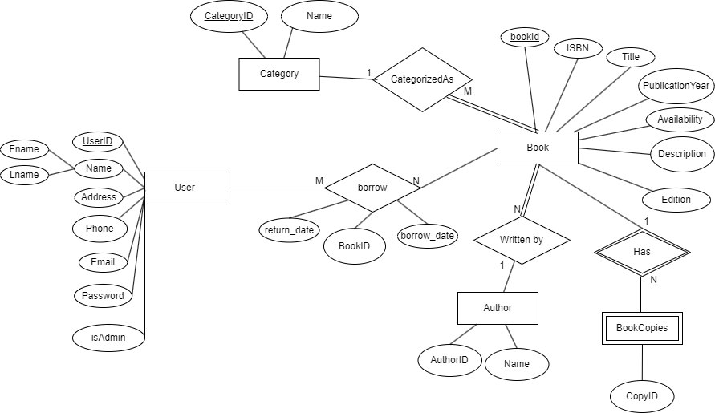

# Library Management System

## Overview
The Library Management System is a C# application designed to streamline the management of a library's book inventory, user accounts, and transaction records.

## Features
- **Book Management:** Add, update, delete, and search for books.
- **User Management:** Register and manage library members.
- **Transaction Management:** Track book borrowing and returns.
- **Reporting:** Generate detailed reports on books, users, and transactions.

## Getting Started

### Prerequisites
- .NET Framework
- SQL Server
<<<<<<< HEAD
### Data Model and ER diagram

<p align="center">
  
  <br>
  <em>Figure 1: Entity Relation Diagram</em>
</p>
<p align="center">
  
  <br>
  <em>Figure 1: Physical Diagram</em>
</p>
<p align="center">
  
  <br>
  <em>Figure 1: Conceptual Diagram</em>
</p>
=======
>>>>>>> 2083537c5bac1307be8da6e94df53638a28cc4a0

### Installation
1. Clone the repository:
   ```bash
   git clone https://github.com/Eslam-Sayed7/Library-Managment-System.git
2. Open Library Management System.sln in Visual Studio.
3. Configure the database connection in App.config and DBconnect class.
4. Build and run the application.
### Database Setup
1. Restore the database using **LibraryDB.bacpac** in SQL Server.
2. Execute the SQL scripts in the **libraryDB** folder to set up tables and initial data.
### Usage
1. Launch the application.
2. Navigate through the main menu to access various features.
3. Manage books, users, and transactions as needed.
<<<<<<< HEAD
=======
### Contributing
Contributions are welcome! Please fork the repository and submit a pull request with your changes.

### License
This project is licensed under the MIT License.

### Contact
For inquiries or issues, please open an issue in the repository or contact the maintainer.
>>>>>>> 2083537c5bac1307be8da6e94df53638a28cc4a0
